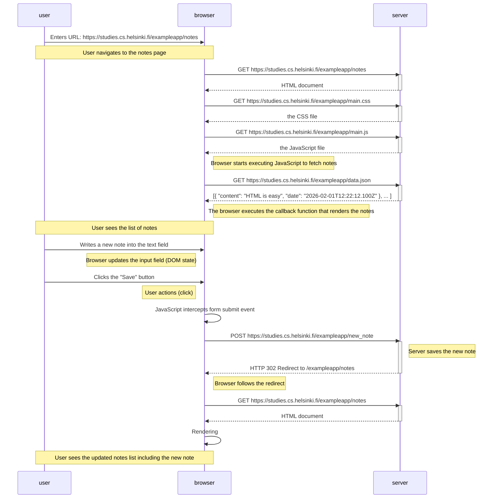
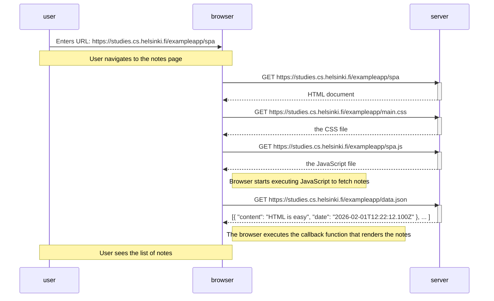
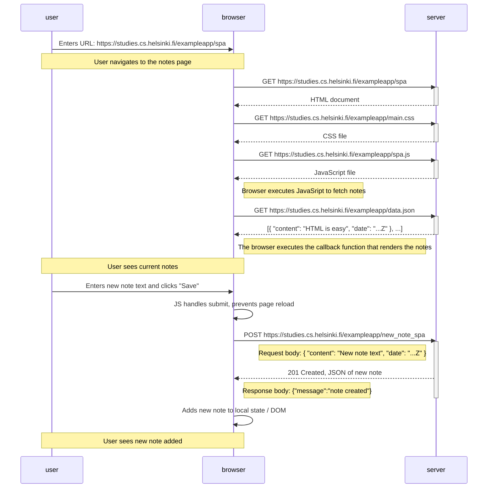

# Part0

General info & fundamentals of Web apps.

## Exercises 0.1 - 0.3

**HTML, CSS and JavaScript.**

_These exercises are for reading only. No submission to GitHub is required._

## Exercise 0.4 - New note 

**Task:** Create a similar diagram depicting the situation where the user creates a new note on the page https://studies.cs.helsinki.fi/exampleapp/notes by writing something into the text field and clicking the Save button.

_Example:_

```text
sequenceDiagram
    participant browser
    participant server

    browser->>server: GET https://studies.cs.helsinki.fi/exampleapp/notes
    activate server
    server-->>browser: HTML document
    deactivate server

    browser->>server: GET https://studies.cs.helsinki.fi/exampleapp/main.css
    activate server
    server-->>browser: the css file
    deactivate server

    browser->>server: GET https://studies.cs.helsinki.fi/exampleapp/main.js
    activate server
    server-->>browser: the JavaScript file
    deactivate server

    Note right of browser: The browser starts executing the JavaScript code that fetches the JSON from the server

    browser->>server: GET https://studies.cs.helsinki.fi/exampleapp/data.json
    activate server
    server-->>browser: [{ "content": "HTML is easy", "date": "2023-1-1" }, ... ]
    deactivate server

    Note right of browser: The browser executes the callback function that renders the notes
 ``` 
If necessary, show operations on the browser or on the server as comments on the diagram.

The diagram does not have to be a sequence diagram. Any sensible way of presenting the events is fine.

All necessary information for doing this, and the next two exercises, can be found in the text of this part. The idea of these exercises is to read the text once more and to think through what is going on there. Reading the application code is not necessary, but it is of course possible.

You can do the diagrams with any program, but perhaps the easiest and the best way to do diagrams is the Mermaid syntax that is now implemented in GitHub Markdown pages!

**Diagram:**



## Exercise 0.5 - Single page app diagram

**Task:** Create a diagram depicting the situation where the user goes to the single-page app version of the notes app at https://studies.cs.helsinki.fi/exampleapp/spa.

**Diagram:**



## Exercise 0.6 - New note in SPA

**Task:** Create a diagram depicting the situation where the user creates a new note using the single-page version of the app.

**Diagram:**



## Tutorial

1. [UML Sequence Diagrams – GeeksforGeeks](https://www.geeksforgeeks.org/system-design/unified-modeling-language-uml-sequence-diagrams/)
2. [Include diagrams in Markdown files – GitHub Blog](https://github.blog/developer-skills/github/include-diagrams-markdown-files-mermaid/)
3. [Mermaid JS Introduction](https://mermaid.js.org/intro/)
4. [Git](https://product.hubspot.com/blog/git-and-github-tutorial-for-beginners)
