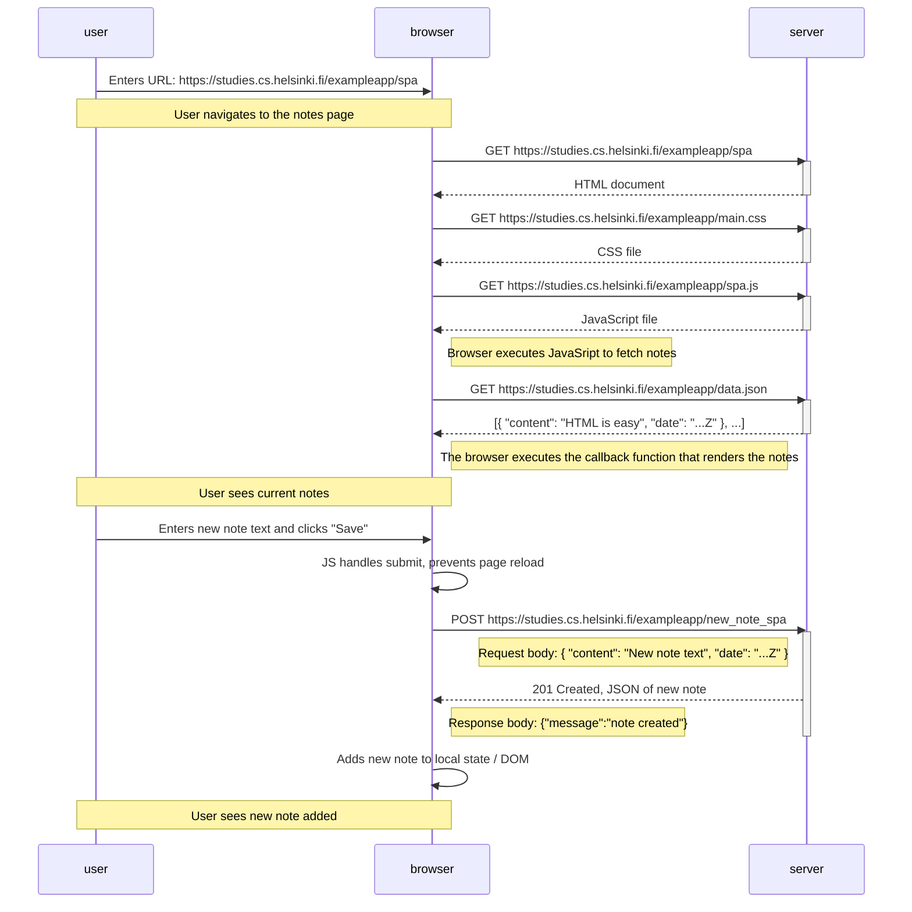

```mermaid
sequenceDiagram
    participant user
    participant browser
    participant server

    %% --- User enters URL ---
    user->>browser: Enters URL: https://studies.cs.helsinki.fi/exampleapp/spa
    Note over user,browser: User navigates to the notes page

    %% --- Browser fetches initial files ---
    browser->>server: GET https://studies.cs.helsinki.fi/exampleapp/spa
    activate server
    server-->>browser: HTML document
    deactivate server

    browser->>server: GET https://studies.cs.helsinki.fi/exampleapp/main.css
    activate server
    server-->>browser: CSS file
    deactivate server

    browser->>server: GET https://studies.cs.helsinki.fi/exampleapp/spa.js
    activate server
    server-->>browser: JavaScript file
    deactivate server

    Note right of browser: Browser executes JavaSript to fetch notes

    browser->>server: GET https://studies.cs.helsinki.fi/exampleapp/data.json
    activate server
    server-->>browser: [{ "content": "HTML is easy", "date": "...Z" }, ...]
    deactivate server

    Note right of browser: The browser executes the callback function that renders the notes

    Note over user,browser: User sees current notes

    %% --- User creates new note ---
    user->>browser: Enters new note text and clicks "Save"
    browser->>browser: JS handles submit, prevents page reload

    %% --- Browser sends new note to server ---
    browser->>server: POST https://studies.cs.helsinki.fi/exampleapp/new_note_spa
    activate server
    Note left of server: Request body: { "content": "New note text", "date": "...Z" }
    server-->>browser: 201 Created, JSON of new note
    Note right of browser: Response body: {"message":"note created"}
    deactivate server

    %% --- Browser updates ---
    browser->>browser: Adds new note to local state / DOM
    Note over user,browser: User sees new note added
```