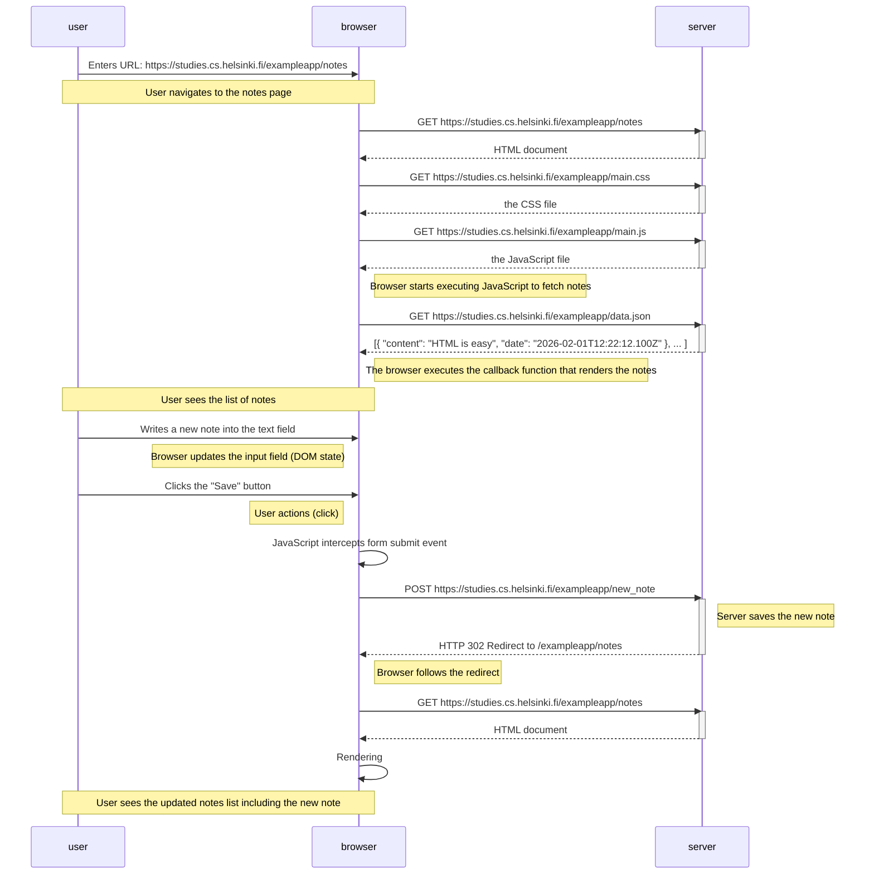

```mermaid
sequenceDiagram
    participant user
    participant browser
    participant server

    %% --- User enters URL ---
    user->>browser: Enters URL: https://studies.cs.helsinki.fi/exampleapp/notes
    Note over user,browser: User navigates to the notes page

    %% --- Browser fetches initial files ---
    browser->>server: GET https://studies.cs.helsinki.fi/exampleapp/notes
    activate server
    server-->>browser: HTML document
    deactivate server

    browser->>server: GET https://studies.cs.helsinki.fi/exampleapp/main.css
    activate server
    server-->>browser: the CSS file
    deactivate server

    browser->>server: GET https://studies.cs.helsinki.fi/exampleapp/main.js
    activate server
    server-->>browser: the JavaScript file
    deactivate server

    Note right of browser: Browser starts executing JavaScript to fetch notes

    browser->>server: GET https://studies.cs.helsinki.fi/exampleapp/data.json
    activate server
    server-->>browser: [{ "content": "HTML is easy", "date": "2026-02-01T12:22:12.100Z" }, ... ]
    deactivate server

    Note right of browser: The browser executes the callback function that renders the notes

    Note over user,browser: User sees the list of notes

    %% --- User adds a new note ---
    user->>browser: Writes a new note into the text field
    Note left of browser: Browser updates the input field (DOM state)

    user->>browser: Clicks the "Save" button
    Note left of browser: User actions (click)

    browser->>browser: JavaScript intercepts form submit event

    browser->>server: POST https://studies.cs.helsinki.fi/exampleapp/new_note
    activate server
    Note right of server: Server saves the new note
    server-->>browser: HTTP 302 Redirect to /exampleapp/notes
    deactivate server

    Note right of browser: Browser follows the redirect

    browser->>server: GET https://studies.cs.helsinki.fi/exampleapp/notes
    activate server
    server-->>browser: HTML document
    deactivate server

    browser->>browser: Rendering

    Note over user,browser: User sees the updated notes list including the new note
```
